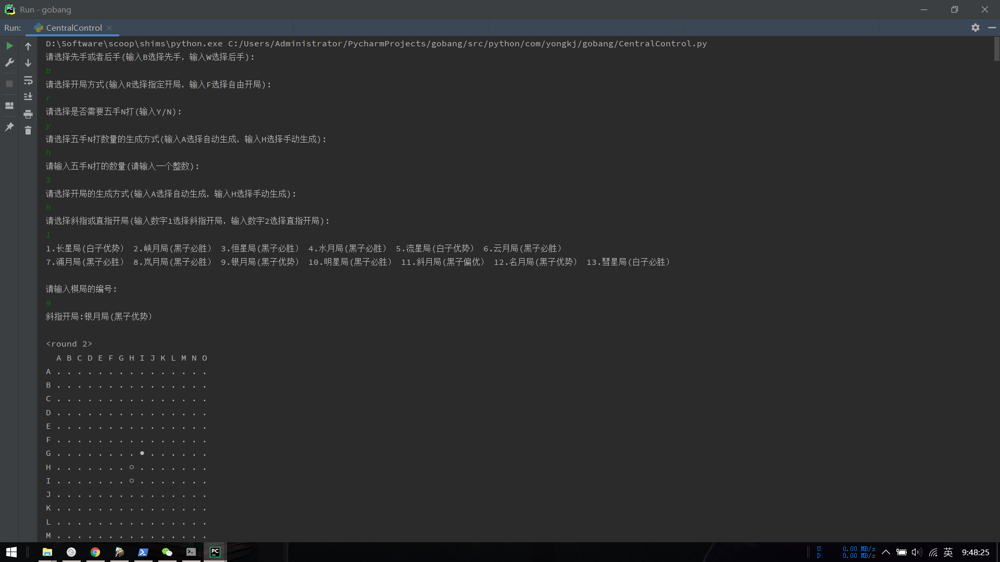
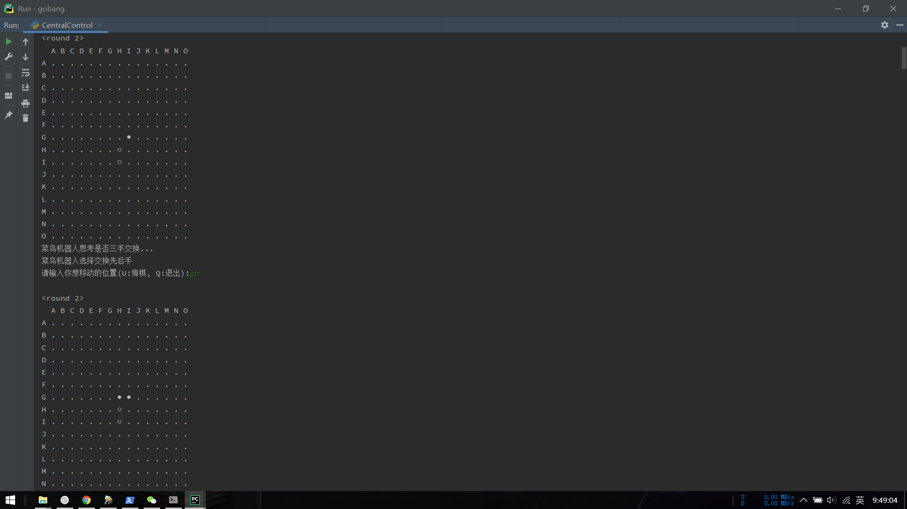
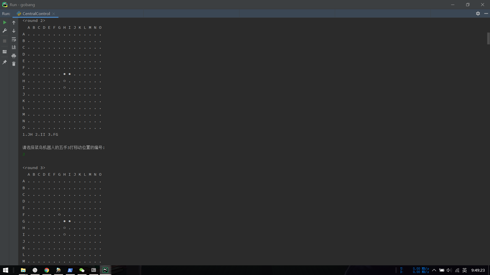
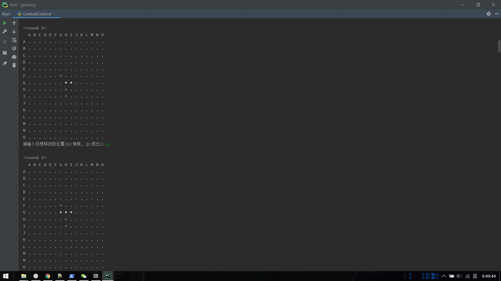
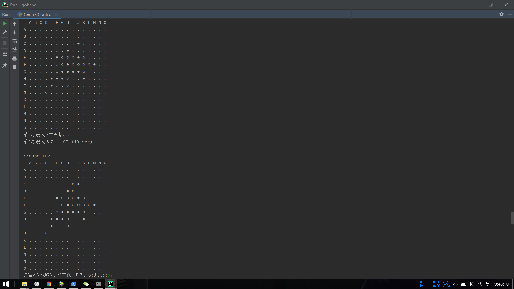
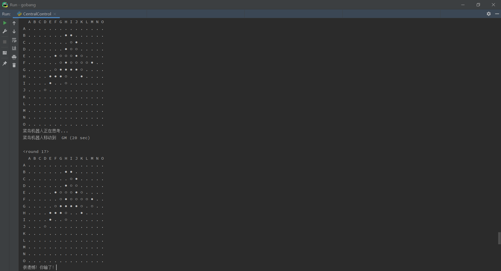

# 菜到安详的五子棋

#### 介绍
本项目为学习与研究项目，通过设计与实现一个五子棋游戏，体会算法的设计与分析过程，增强对于算法的学习能力，提高使用算法解决实际问题的能力。主要功能包括选择先后手、选择开局方式、三手交换、五手N打、保存棋盘记录、判断胜负输赢等。

#### 截图

#### 技术栈
MySQL+Python

1.  采用 Alpha-Beta 剪枝算法搜索棋盘
2.  使用 MySQL 数据库保存五子棋指定开局中的二十六种开局方式

#### 功能特性

1.  目前只实现了命令行界面，通过键盘输入的方式控制棋盘
2.  先后手的选择包括输入b（Black，黑棋）选择先手，输入w（White，白棋）选择后手
3.  开局方式有两种，一种是指定开局（有二十六种指定开局），另一种是自由开局（先下黑棋，后下白棋）
4.  在下第四个棋子，也就是白子时，此时白方可根据棋局特点是否选择交换黑白棋子，交换之后，棋局保持不变，但是白方将会变为黑方，称之为三手交换
5.  在下第五个棋子时，也就是黑子时，此时黑方根据棋局的特点可下多个棋子（事先由黑方决定下多少个），由白方选择其中一个棋子作为第五个棋子，称之为五手N打
6.  可对常见的五子棋禁手进行判断，包括三三禁手、三四禁手、四四禁手、长连禁手等
7.  棋局出现胜负输赢后，将游戏过程中产生的棋局保存到数据库中，玩家的下棋坐标则保存到文件中，方便对棋局进行分析

#### 使用说明

1.  gobang.sql 为数据库备份文件
2.  可在 src/python/com/yongkj/gobang/SaveInfoToDB.py 和 src/python/com/yongkj/gobang/SpecifiedStart.py 文件中修改数据库连接信息
3.  此项目为 Python 项目，需配置 Python3 环境，并且使用 Pycharm 才能正常运行
